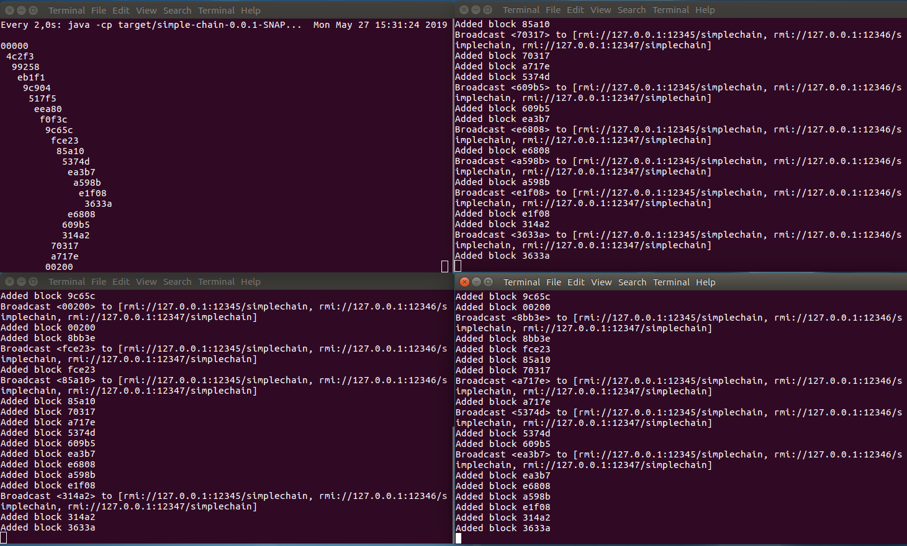

# simple-blockchain

A simple java implementation of Blockchain.

Currently:

* the P2P network is implemented using java RMI (Remote Method Invocation)
* the list of participants is shared using a file

## Compile

```
mvn clean package
```


## Run the demo

```
./demo.sh
```

This will 4 terminals:

* 3 separate miners
* 1 window to watch the evolution of the chain

